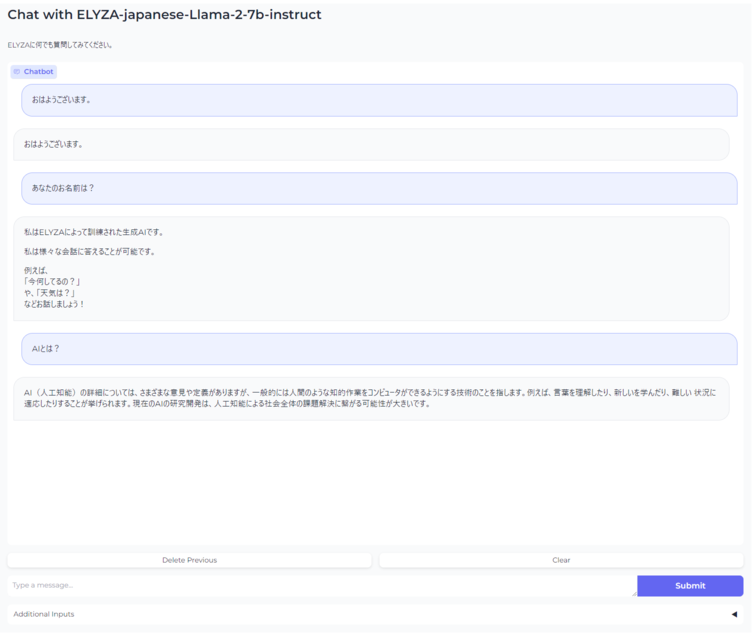

# Web アプリの概要


## アプリの実行

`app.py` スクリプトを実行すると、Gradio ベースの UI で動作する日本語 LLM の チャットボットアプリを使うことができます。



## 使用モデル

このアプリのデフォルトでは、株式会社 ELYZA さんが提供する ELYZA-japanese-Llama-2-7b-fast-instruct を Momonga さんが AWQ フォーマットで量子化してくださったモデル[ELYZA-japanese-Llama-2-7b-fast-instruct-AWQ-calib-ja-100k](https://huggingface.co/mmnga/ELYZA-japanese-Llama-2-7b-fast-instruct-AWQ-calib-ja-100k)を Hugging Face からダウンロードして使用できるように設定しています。


## 必要なパッケージのインストール

`requirements.txt` を使ってパッケージをインストールしてください。なお、ファイルには後述する`rag.py`の実行時に必要となるパッケージも含まれています。

```
pip install -r requirements.txt
```

## モデルのダウンロード
モデルをダウンロードするために、Hugging Face から発行された[アクセストークン](https://huggingface.co/docs/hub/security-tokens)が必要になります。app.py ファイルと同じディレクトリ内に .env ファイルを置いて、ファイル中に CLI_TOKEN=XXXXXX (XXXXXXは、アクセストークン) と入力してください。これにより、環境変数の設定がサポートされ、モデルがダウンロードできます。


## UI の使い方

-	アプリの UIでは、モデルの振る舞いを決めるシステムプロンプトの入力、最大トークン数、temperature、Top-p、Top_k、重複ペナルティのパラメーターが設定できます。設定値の設定範囲をカスタマイズすることもできます。チャットボットコンポーネントのコード部分 gr.ChatInterface() に記述してある gr.Slider(下限値, 上限値, デフォルト値) の各数値を変更し、最適化してください。

-	ユーザーが UI 上で質問を入力すると、generate_response 関数が呼び出され、ユーザーの入力とシステムの対話履歴を受け取り、モデルを使用してその質問への応答を生成します。


## RAG 機能

-	`rag.py` というスクリプトでは、app.py に LangChain の RetrievalQA を利用してRAG 機能を追加しました。指定された URL から Web 検索して、テキストを抽出し、rag.py ファイルのあるディレクトリ内に textfile.txt ファイルを作成します。なお、スクリプトを実行する前に、コード内の"https:############"に参照するサイトのURLを入力してください。

-	Hugging Face から [multilingual-e5-small](https://huggingface.co/intfloat/multilingual-e5-small)という embedding (ベクトル化) 用のモデルをダウンロードするように設定しています。GPU への負荷を抑える意図で軽量なモデルを初期設定していますが、様々なモデルが公開されているので、必要に応じて変更してください。

-	また、text_splitter (テキストの分割) のチャンク数や retriever (検索システム) の設定も適した値に調整してください。


## CUDAの設定

CUDAを利用するには、CUDA Toolkit、cuDNN、PyTorchのインストールや初期設定が必要です。主にWindows10/11の場合になりますが、以下の手順を参考にしてください。

-	NVIDIA GPUに対応するCUDA Toolkitのバージョンを[CUDAリリースノート：Table 3](https://docs.nvidia.com/cuda/cuda-toolkit-release-notes/index.html#id5) で確認してください。CUDA Toolkitのインストール: [CUDA Toolkitのダウンロードページ](https://developer.nvidia.com/cuda-toolkit-archive)から適切なバージョンをダウンロードし、インストールします。その後、コマンドプロンプトで nvcc -V を実行して、正常にインストールされているかを確認します。


-	cuDNNは、[CUDAとcuDNNとの対応表](https://docs.nvidia.com/deeplearning/cudnn/reference/support-matrix.html#gpu-cuda-toolkit-and-cuda-driver-requirements)で対応バージョンを確認してください。cuDNNのインストール: [cuDNNのダウンロードページ ](https://developer.download.nvidia.com/compute/cudnn/redist/cudnn/windows-x86_64/)からzipファイルをダウンロードし、解凍したcuDNN フォルダを”C:\Program Files\NVIDIA GPU Computing Toolkit\ CUDA \vXX.X”（XX.Xはバージョン）にコピーします。その後システムがcuDNNを認識できるように環境変数を設定します。システム環境変数に変数名”CUDNN_PATH”と変数値” C:\Program Files\NVIDIA GPU Computing Toolkit\ CUDA \vXX.X\cudnn”を設定してください。


-	PyTorchのインストール: [PyTorchのインストールページ](https://pytorch.org/get-started/locally/) から適切なコマンドを使用してインストールします。インストール後、Pythonで以下のコードを実行し、返される値が ターミナルでTrue であることを確認します。

```
import torch

torch.cuda.is_available()
```
